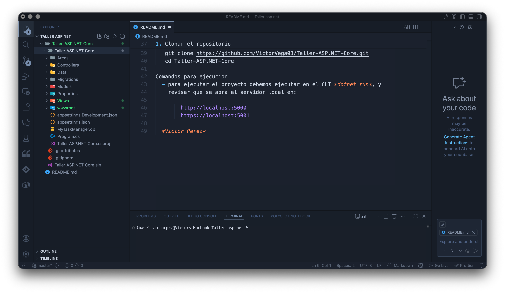

Basado en lo visto en el Taller-ASP.NET-Core

Descripción
Este repositorio contiene un proyecto de ejemplo para un taller práctico desarrollado con **ASP.NET Core**. Sirve como base para comprender la estructura, configuración y funcionamiento general de aplicaciones web creadas con .NET, incluyendo controladores, vistas/páginas, modelos y archivos estáticos.

Contenido del repositorio

- `Taller-ASP.NET-Core.sln` — solución principal del proyecto.  
- `.gitignore` — reglas para ignorar binarios, archivos temporales y configuraciones sensibles.  
- `.gitattributes` — configuraciones adicionales del repositorio.  
- Carpetas del proyecto ASP.NET Core:
  - `Controllers/` — controladores (MVC o API).
  - `Models/` — modelos/entidades utilizados por la aplicación.
  - `Views/` o `Pages/` — vistas de Razor o páginas.
  - `wwwroot/` — archivos estáticos (CSS, JS, imágenes).
  - `appsettings.json` — configuración principal.
  - `Program.cs` o `Startup.cs` — punto de entrada y configuración de servicios.

---

Requisitos previos
Antes de ejecutar el proyecto debes tener instalado:

- .NET SDK (versión compatible con el proyecto).  
  Puedes validar instalando el SDK desde Microsoft:  
  https://learn.microsoft.com/es-es/dotnet/core/tools/dotnet-new-sdk-templates  
- Un editor o IDE, por ejemplo:  
  - Visual Studio  
  - Visual Studio Code  
  - JetBrains Rider  
- Servidor de base de datos si tu proyecto necesita uno (SQL Server, SQLite, MySQL, etc.).

---

Instalación y configuración local

1. Clonar el repositorio

   git clone https://github.com/VictorVega03/Taller-ASP.NET-Core.git
   cd Taller-ASP.NET-Core

Comandos para ejecucion
  - para ejecutar el proyecto debemos ejecutar en el CLI *dotnet run*, y
    revisar que se abra el servidor local en:
    
        http://localhost:5000
        https://localhost:5001

  *Victor Perez*
  